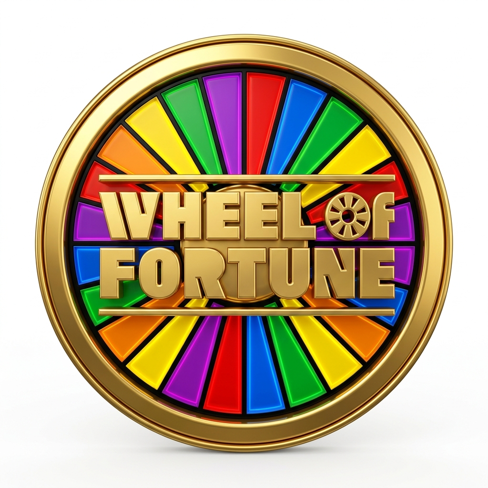
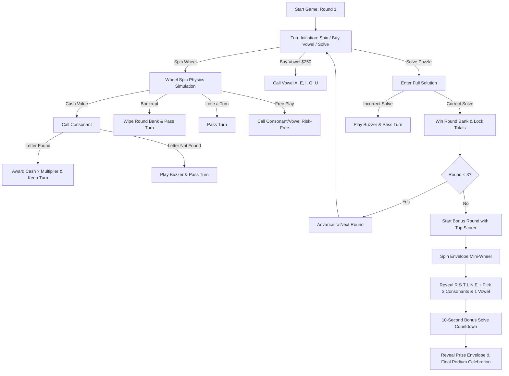

<div align="center">



# Wheel of Fortune

**A broadcast-authentic, interactive television game show experience built with React, TypeScript, Tailwind CSS, HTML5 Canvas, and Web Audio API.**

[](https://reactjs.org/)
[](https://www.typescriptlang.org/)
[](https://tailwindcss.com/)
[](https://vitejs.dev/)
[](LICENSE)

[Game Features](#-key-features) • [Gameplay Flow](#-gameplay-rules--loop) • [Technical Architecture](#-technical-architecture) • [Getting Started](#-getting-started)

---

</div>

## 🌟 Overview

**Wheel of Fortune** is a web-based recreation of America's game show. It faithfully models the core mechanics, timing, physics, sound synthesis, and visual aesthetics of the syndicated broadcast:

- **24-Wedge Physics Wheel**: Interactive rotational physics simulation with flipper friction, audible peg clicks, dynamic wedge multipliers, and special wedges (*Free Play*, *Bankrupt*, *Lose a Turn*, *Prize Cards*, and *$1,000,000 Wedge*).
- **52-Trilon Puzzle Matrix**: Standard 4-row puzzle board `[12, 14, 14, 12]` with smooth 3D trilons, automated word wrapping, and synchronized audio reveals.
- **Dynamic Procedural Phrase Generator**: On-the-fly puzzle synthesis spanning 16+ categories with word-length validation and instant random re-roll capabilities.
- **Multi-Round Tournament & Bonus Finale**: 3 competitive main rounds featuring 3-player podiums with active turn state, followed by the Grand Finalist Bonus Round with mini envelope wheel spinning, automatic `R-S-T-L-N-E` reveals, custom letter selections, and an interactive 10-second countdown.
- **Synthesized Web Audio Engine**: Zero-asset procedural audio generation recreating the signature studio wheel clicks, letter reveal chimes, raspy game show buzzers, solve fanfares, bankrupt slides, and countdown ticks.

---

## 🎮 Key Features

### 🎡 Broadcast-Accurate Wheel Physics
- High-DPI HTML5 2D Canvas engine with radial gradients, chrome bezels, and 24 distinct wedge sections.
- Variable rotational drag and flipper elasticity simulating physical wheel inertia and satisfying mechanical deceleration.
- Audio synthesis synced to needle collisions with realistic pitch-scaled peg velocity.

### 🧩 52-Slot Trilon Puzzle Board
- Modeled after the Sony Pictures Studios LED puzzle matrix.
- Automated greedy line-breaking algorithm with hyphenation prevention to ensure clean centering.
- Individual flip animations for active letter tiles with green border illumination.

### 🧠 Dynamic Random Phrase Engine
- Generates endless combinations of valid TV game show puzzles across popular categories:
  - `PHRASE`, `WHAT ARE YOU DOING?`, `AROUND THE HOUSE`, `BEFORE & AFTER`, `FOOD & DRINK`
  - `LIVING THING`, `FUN & GAMES`, `LANDMARK`, `OCCUPATION`, `SHOW BIZ`, `RHYME TIME`
- On-demand **Random Phrase** re-roll action for continuous variety.

### 🎙️ Host Broadcast Ticker & Interactive Controls
- Context-aware host ticker announcing turn transitions, spin outcomes, letter calling states, and round summaries.
- Virtual on-screen consonant and vowel keypad with live disabled states and cash balance validations.
- Full keyboard shortcut support for rapid letter calling and natural desktop play.

### 🏆 Grand Finale Bonus Round
- Dynamic qualifier identification advancing the highest-scoring contestant.
- Mini golden envelope wheel spin with 24 prize containers (ranging from $35,000 up to $1,000,000).
- Standard automatic `R, S, T, L, N, E` distribution followed by player letter picks (3 consonants + 1 vowel).
- Live 10-second countdown solver interface with real-time string normalization.

---

## 🔄 Gameplay Rules & Loop



---

## 🛠️ Technical Architecture

| Module | Technologies | Description |
| :--- | :--- | :--- |
| **UI & State Management** | React 18, TypeScript, Hooks | Manages game phases, turns, banks, called letters, and modal states. |
| **Styling & Animations** | Tailwind CSS, Lucide React, Motion | TV studio color schemes, responsive podiums, glowing LEDs, and modal transitions. |
| **Wheel Engine** | HTML5 2D Canvas, RequestAnimationFrame | Vector wheel rendering, rotational momentum, flipper collision detection. |
| **Sound Synthesis** | Web Audio API | Low-latency procedural oscillator and noise generation for all game audio. |
| **Word Wrapping** | Custom Matrix Formatter | 4-row `[12, 14, 14, 12]` constraint-satisfaction word wrap algorithm. |
| **Build & Tooling** | Vite, TypeScript, ESLint | Rapid module bundling and type validation. |

---

## 🚀 Getting Started

### Prerequisites
- [Node.js](https://nodejs.org/) (version 18.0 or higher)
- [npm](https://www.npmjs.com/) or [bun](https://bun.sh/)

### Installation

1. **Clone the repository:**
   ```bash
   git clone https://github.com/your-username/wheel-of-fortune.git
   cd wheel-of-fortune
   ```

2. **Install dependencies:**
   ```bash
   npm install
   ```

3. **Launch local development server:**
   ```bash
   npm run dev
   ```
   Open `http://localhost:3000` in your browser.

4. **Build for production:**
   ```bash
   npm run build
   ```

---

## 📁 Project Structure

```
├── public/
│   └── assets/
│       └── wheel_of_fortune_logo.jpg    # Game show emblem banner logo
├── src/
│   ├── components/
│   │   ├── BonusRoundView.tsx           # Bonus stage envelope wheel & solver
│   │   ├── ControlPanel.tsx             # Action buttons & letter picker keypad
│   │   ├── GameHostBar.tsx              # Ticker announcer & header utility controls
│   │   ├── PuzzleBoard.tsx              # 52-trilon responsive puzzle board
│   │   ├── RollingWheelStage.tsx        # Stage container with flipper pointer
│   │   ├── ScorePodium.tsx              # 3-player score displays & active player lights
│   │   ├── SpecsModal.tsx               # Architecture and rules documentation modal
│   │   └── WheelCanvas.tsx              # HTML5 Canvas rotational physics simulation
│   ├── engine/
│   │   ├── puzzles.ts                   # Procedural phrase generation & word pools
│   │   ├── soundEngine.ts               # Web Audio API procedural sound synthesizer
│   │   ├── wheelData.ts                 # Wheel wedge configurations & envelope prizes
│   │   └── wordWrapping.ts              # 4-row matrix word wrapping algorithm
│   ├── App.tsx                          # Core game controller & state orchestration
│   ├── main.tsx                         # Application entry point
│   ├── types.ts                         # Shared TypeScript definitions & game interfaces
│   └── index.css                        # Tailwind CSS global styles & custom fonts
├── index.html                           # HTML template
├── package.json                         # Project dependencies & scripts
├── tsconfig.json                        # TypeScript configuration
└── vite.config.ts                       # Vite build configuration
```

---

## 🔊 Audio Engine Documentation

All audio cues are synthesized dynamically in real-time with zero external audio file latency:

- **Peg Click**: High-frequency damped sine ping with velocity-sensitive pitch modulation.
- **Letter Reveal Chime**: Resonant dual-bell studio chime (C6/E6 harmonic blend).
- **Game Show Buzzer**: Raspy single sustained 520ms discordant sawtooth/square tone with 88Hz sub-harmonic grit and low-pass cabinet filtering.
- **Puzzle Solve Fanfare**: Ascending major triad arpeggio with celebratory harmonic chime decay.
- **Bankrupt Slide**: Downward frequency whistle slide with descending crash impact.
- **Bonus Countdown Tick**: Crisp mechanical studio clock ticks.
- **Envelope Reveal**: Sparkle sweep tone for dramatic prize reveals.

---

## 📄 License

This project is licensed under the [MIT License](LICENSE).
